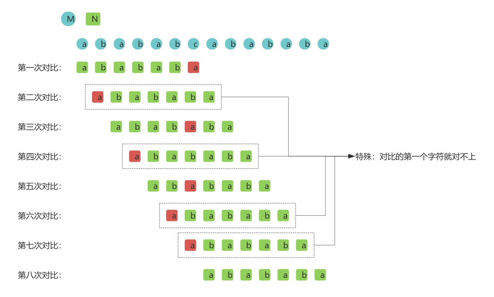
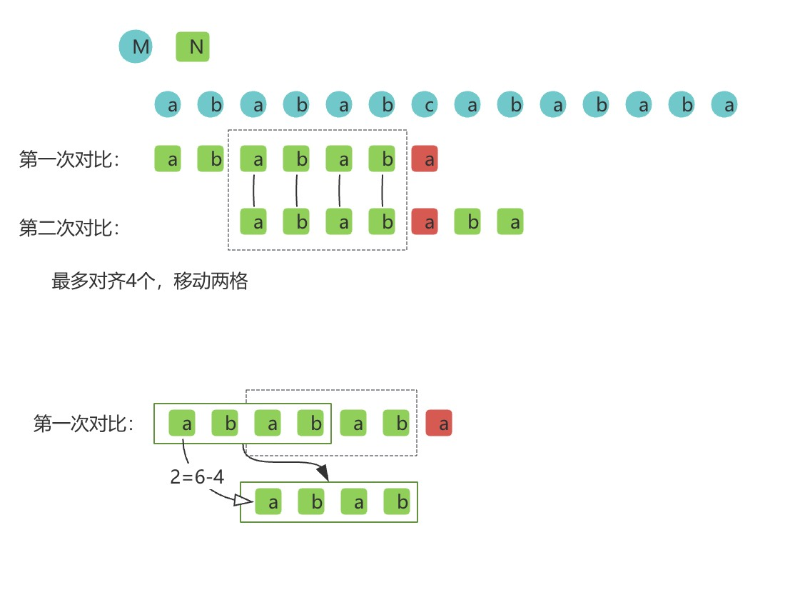
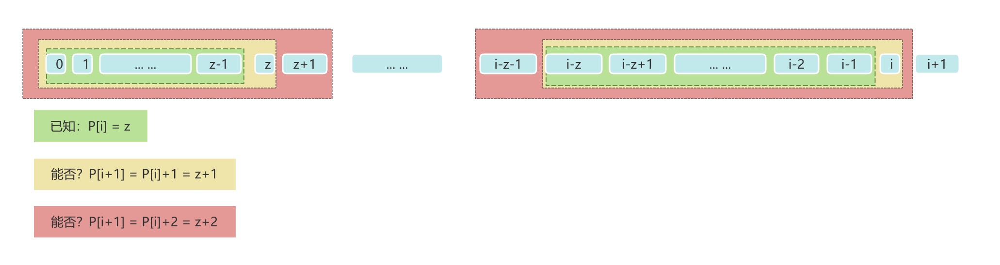

# 引言
闲来无事逛逼乎，看到模式匹配算法，仔细想了想：我好像已经忘了，可能之前也只在刷题刷到过，看懂过，但是估计当时是个一知半解的状态，脑海里完全没有推导的过程。所以，开篇自己的推导，留给下次复习(doge

字符串匹配，就是需要判断A字符串中是否存在能够匹配B字符串(模板字符串)的子串，是一个非常经典的~~面试~~算法题

整篇用一个例子来记录和推导：
```java
// M：被匹配字符串，N：模版字符串
M: a b a b a b c a b a b a b a
N: a b a b a b a
// 成功匹配
M: a b a b a b c a b a b a b a
N:               a b a b a b a
```
# 暴力解法
很自然朴素的想法：从头开始匹配，匹配不上就移动一格，然后继续匹配
```java
class KMP {
    public int strStr(String haystack, String needle) {
        Character firstChar = needle.charAt(0);
        for(int i = 0; i < haystack.length(); i++){
            // 对比模版字符串
            if(i+needle.length() <= haystack.length() &&haystack.substring(i,i+needle.length()).equals(needle)){
                return i;
            }
        }
        return -1;
    }
}
```


仔细观察图中的流程，会发现存在一种情况：
- 刚刚开始对比就能发现第一个字符串就对不上

# 暴力解法带来的思考和推导
## 思考
1. 是不是能提前知道这次对比是否有效就好了？

-> 显然这不可能，要是能提前知道，也不用对比了；但是退一点想，要是进入下次对比时，不从头开始对就好了，提前知道前面那些是能对齐的

2. 每次移动一格，那要是每次能移动多格就好了?

-> 这个思路好！

转念一想，要想优化这个时间复杂度，要么破天荒的精妙数学规律，要么老实一点空间换时间。

细节一点，在模板字符上哪里对不上，都能知道下次能够移动的最大距离，这很像是一个模版字符串长度的数组，记录着最大移动距离

进一步想，这个最大距离和什么有关呢？结合第一点，移动的最大距离最好保证能提前对齐多个(最多个)，这样下次对比才是最省的。

## 推导
那么现在问题变成了

1. 已知对不上的情况；
2. 找到能对齐最多个的移动距离；
3. 有个难以想到的限制：在对不上的情况下去分析，那么一定只能在对不上的字符之前的字符串去分析，因为后面的情况是未知的。

首先我们看这个手动测量的结果：



再来分析这个结论：

1. 很自然的看出，对齐最多个的大小，即找到对不上的字符前的子串中最长的前缀=最长的后缀，其中前后缀的大小。当然前后缀都是真子集，不含本身。
2. 移动的距离 = 子串大小 - 对齐大小

## 空间复杂度的提升
那么现在问题变成了

1. 已知模版字符串
2. 找到每个字符下能够移动的最大距离（即，字符前字符串，最长相同的前缀和后缀）

### 暴力解法
|位置 |   子串  | 前缀  | 后缀| 最长相同前后缀| 移动距离(最小为1)|
|---- |  ----  | ----  |----|----|----|
| 0 | \  | \ | \ | 0 | 0-0=0 |
| 1 | a  | \ | \ | \ | 0-0=0 |
| 2 | ab | {a} | {b} | \ | 2-0=2|
| 3 | aba | {a,ab}| {a,ba} | {a} | 3-1=2 |
| 4 | abab | {a,ab,aba} | {b,ab,bab} | {ab} | 4-2=2 |
| 5 | ababa | {a,ab,aba,abab} | {a,ba,aba,baba} | {aba} | 5-3=2|
| 6 | ababab | {a,ab,aba,abab,ababa} | {b,ab,bab,abab,babab} | {abab} | 6-4=2|

可以看到这个暴力解法直接回到了模式匹配的暴力解法，不能采用

那么思考要么破天荒的精妙数学规律，要么老实一点空间换时间。开动脑筋想一想，第i+1的最长相同前后缀长度是不是能比第i个大1？没错，子串多了个字符，但是能大2嘛？我们来推导一下。

### 数学推导

$$
已知: \\
1.\quad N = 模版字符串,\quad N_x=x_{th}字符,\quad x \in[0,n]\\
2.\quad P[x] = x_{th} 字符的最长相同前后缀的长度,\quad x \in[0,n]\\
3.\quad P[i] = z,\quad i\in[0,n],\quad z\in[0,i-1]\\
求：\\
1. \quad 是否可能\quad P[i+1] = P[i] + 1 = z + 1 \quad ?\\
2. \quad 是否可能\quad P[i+1] = P[i] + 2 = z + 2 \quad ?\\
$$



$$
\because\quad P[i]=z \\
\therefore \quad N_0 = N_{i-z}\\
N_1 = N_{i-z+1}\\
N_{z-1} = N_{i-1}\\
\implies N_x = N_{i-z+x},\quad \forall x\in[0,z-1]\\
\because \quad P[i]=z \\
N_0 = N_{i-z-1} \\
N_1 = N_{i-z} \\
N_z = N_{i-1} \\
\implies N_x \neq N_{i-z-1+x},\quad \exist x\in[0,z] \\
已知\quad \textcolor{green}{P[i]=z \implies \begin{cases}
 N_x = N_{i-z+x},\quad \forall x\in[0,z-1]\\
N_x \neq N_{i-z-1+x},\quad \exist x\in[0,z] \\
\end{cases}}\\
\quad \\
\because \quad 假设\quad P[i+1] = P[i] + 1 = z + 1 \\
\therefore \quad \textcolor{yellow}{N_x = N_{i-z+x},\quad \forall x\in[0,z]} \\
\therefore \quad 只需要满足 N_z=N_i，假设即可成立 \\
\quad \\
\because \quad 假设\quad P[i+1] = P[i] + 2 = z + 2 \\
\therefore \quad \textcolor{red}{N_x = N_{i-z-1+x},\quad \forall x\in[0,z+1]} \\
\because \quad  N_x \neq N_{i-z-1+x},\quad \exist x\in[0,z] \\
\therefore \quad 假设不成立 \\
\quad \\
\therefore 综上：P[i+1]\leq P[i]+1

$$

拿到最后的结论，那这就比暴力枚举要好多了，每次求P[i+1]时，总是从P[i]+1开始判断，然后逐渐递减，直到满足最长相同前后缀。

# KMP算法

能看到这儿基本上也明白KMP算法啦：

1. 获取模版字符串的PMT（Partial Match Table 部分匹配表，也就是上文中的最长相同前后缀大小数组）；
2. 顺序对比，遇到对比不成功，根据子串大小和PMT中的值移动对应距离，进入下次循环，知道对比成功或者结束循环。

```java
class KMP {
    public  int strStr(String haystack, String needle) {
        if (haystack.length() < needle.length() || (haystack.length() == needle.length() && !haystack.equals(needle)))
            return -1;
        int[] pmt = getPMT(needle);
        for (int i = 0; i < haystack.length(); ) {
            int j = 0;
            // 后面可能会对上，保证指标不超出
            for (; i + j < haystack.length() && j < needle.length(); j++) {
                if (haystack.charAt(i + j) != needle.charAt(j)) break;
            }
            if (j == needle.length()) return i;
            // 有可能第一个就对不上
            i = i + (j == 0 ? 1 : (j - pmt[j - 1]));
        }
        return -1;
    }

    public  int[] getPMT(String s) {
        int[] res = new int[s.length()];
        int k = 0;
        res[0] = 0;
        for (int i = 1; i < s.length(); i++) {
            k += 1;
            // P[i+1] <= P[i] + 1
            while (k > 0 && !s.substring(0, k).equals(s.substring(i + 1 - k, i + 1))) {
                k -= 1;
            }
            res[i] = k;
        }
        return res;
    }
}
```