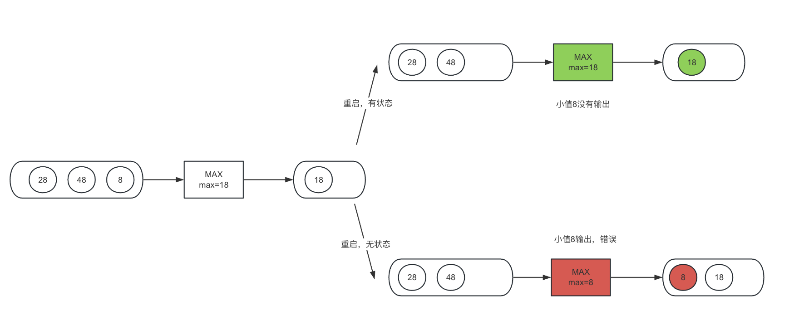

# Intro

“3，2，1，不许动；3，2，1，不许动”，小时候常玩的123木头人在笔者书写时突然冒上了心头，仔细回味中突然震惊【看来我真是天赋异禀】，这不就是检查点机制嘛！ 
- 数数之间的间隔，大家的移动便是数据流的移动；
- 每次回头，朋友之间的站位和到小鬼【实在想不起来数数的名称】之间的距离便是记录的状态；
- Checkpoint机制，便是最简单的“Stop the world”，在小鬼转头的过程大家不能再动了，重新转回去便是Checkpoint完成。 

emmmm，这似乎是个有界数据流的微批处理hhh。
# Why Checkpoint?
状态是Flink中核心的抽象，对于无界数据流，记录着算子在处理数据中的中间结果；在一次Flink流式任务的重启后，算子需要拿到上次的状态才能保证输出结果的正确。 
举个MAX算子的例子：

而Checkpoint便是将状态持久化以便重启后取出恢复的机制。
# How Checkpoint?
> 核心宗旨：对每个算子而言，保存开启这个Checkpoint之后的所有数据在该算子处理完后的状态。 这里的状态不是狭义的指算子记录的值【比如说MAX记录的最大值，SUM记录的总和或者自定义的State】，而是更加广义的 “处理完开启这个Checkpoint后所有数据 ”这个状态。“算子记录的值”是“处理完开启这个Checkpoint后所有数据”的子集，在大部分情况下是等价的。

## STOP THE WORLD

## Aligned Checkpoint

# Why Unaligned?

# How Unaligned? 
# Ref
1. <a href="https://developer.aliyun.com/article/768710" title="aliyun">Flink 1.11 Unaligned Checkpoint 解析</a>