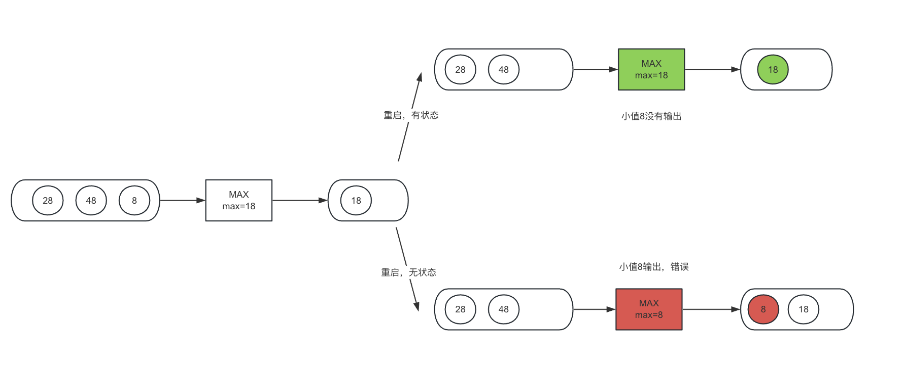
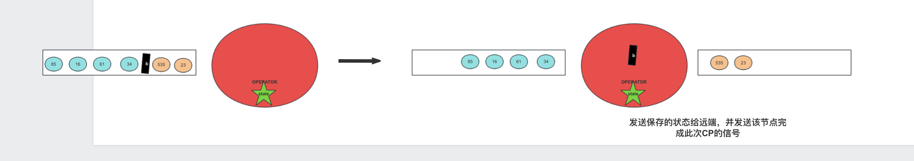

# Intro

“3，2，1，不许动；3，2，1，不许动”，小时候常玩的123木头人在笔者书写时突然冒上了心头，仔细回味中突然震惊【看来我真是天赋异禀】，这不就是检查点机制嘛！ 
- 数数之间的间隔，大家的移动便是数据流的移动；
- 每次回头，朋友之间的站位和到小鬼【实在想不起来数数的名称】之间的距离便是记录的状态；
- Checkpoint机制，便是最简单的“Stop the world”，在小鬼转头的过程大家不能再动了，重新转回去便是Checkpoint完成。 

emmmm，这似乎是个有界数据流的微批处理hhh。

# Why Checkpoint?

状态是Flink中核心的抽象，对于无界数据流，记录着算子在处理数据中的中间结果；在一次Flink流式任务的重启后，算子需要拿到上次的状态才能保证输出结果的正确。 
举个MAX算子的例子：

而Checkpoint便是将状态持久化以便重启后取出恢复的机制。

# How Checkpoint?

> 核心宗旨：对每个算子而言，保存开启这个Checkpoint之后的所有数据在该算子处理完后的状态。 这里的状态不是狭义的指算子记录的值【比如说MAX记录的最大值，SUM记录的总和或者自定义的State】，而是更加广义的 “处理完开启这个Checkpoint后所有数据 ”这个状态。“算子记录的值”是“处理完开启这个Checkpoint后所有数据”的子集，在大部分情况下是等价的。

## Aligned Checkpoint

Flink在做CP的时候会在Source端发送一个Barrier标记。
- 对于Source来说这就是一个Offset，表示如果从这个CP恢复重启，Source将从这个Offset回放数据。
- 对于其他算子来说，就需要保证记录算子处理完这个Barrier之前所有数据的算子状态。

用一个最简单的例子来看，假设所有算子的并行度为1，那么流程非常自然。当接到这个Barrier后，就代表这个CP前所有的数据都被该算子处理。

但通常情况下，算子的并行度>>1，所有流程会变得稍显复杂，一个CP发送的Barrier不仅仅只有一个，每条通道之间都会有一个，那么对于算子来说仅仅接收到一个Barrier是不完全的。那么，自然的想法是这些通道内的Barrier都是分裂的，凑齐分裂的Barrier为一个完整的再处理数据就可以了。

没错这个“凑齐”的原理换句话说就是“对齐”，也就是Aligned。

下图比较清晰，先到的Barrier在算子中等待，此通道再流入的数据只能放在算子的input buffer中缓存，等到所有的Barrier都到后，此时也就代表这个CP前所有的数据都被该算子处理。

# Why Unaligned?

在生产环境中，经常会遇到资源不够，数据倾斜等等，这些会导致反压的情况。

如下图，一般情况下，某一个算子处理速度比较慢，下游的数据已经将out buffer给打满了，此时已经无法在向下游发送数据，形成反压。

这时，繁忙的算子很有可能没有对齐Barrier，在已经到达的Barrier的通道Buffer中数据只能缓存不动，未到达Barrier的通道的buffer能继续输出。在算子高压的情况的，任务很有可能发生重启的行为，那么因为此次的CP的没有完成，任务只能从上一次的CP开始恢复，那么未消化完的数据会变得更多。

整体来看，因为算子繁忙 -> 算子反压 -> 无法完成CP -> 任务重启 -> 算子繁忙加剧 -> 算子反压加剧。这是一个恶性的循环。

解决这个问题只需要打破这个循环，在“算子反压 -> 无法完成CP”这一阶段进行打破，只需要让算子在接到部分Barrier后就能开始CP，那么CP就能保证完成，即便任务重启也无需回放重复的数据。

“接到部分的Barrier就开始做CP”，这就是Unaligned。

# How Unaligned? 

# Ref
1. <a href="https://developer.aliyun.com/article/768710" title="aliyun">Flink 1.11 Unaligned Checkpoint 解析</a>